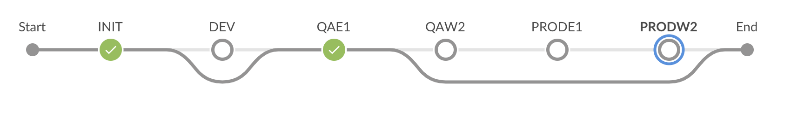

# Jenkins Notes

Declarative and Scripted [syntax](https://jenkins.io/doc/book/pipeline/syntax/)

## skip stage

Jenkins scripted pipeline does not provide a way to skip a stage other than to wrap it in an if-condition (which unfortunately has the effect of behaving as if the stage never existed). The declarative pipelines offer the `when` syntax and can provide nice diagrams as follows,



In order to get this same effect with a scripted library, you can override the `stage()` function to only execute when a condition is met.

```groovy
import org.jenkinsci.plugins.pipeline.modeldefinition.Utils

def stage(name, execute, block) {
  return stage(name, execute ? block : {
    echo "Skip stage $name"
    Utils.markStageSkippedForConditional(STAGE_NAME)
  })
}
```

Using this new `stage()` function is easy. Simply add a parameter to any existing `stage()` blocks to determine when that stage should be run. For example,

```groovy
  stage('DEV', !params.DEV.startsWith('--')) {
    // do something only if the user selected a valid DEV choice
  }
```


## slack integration

Create `token` for [Jenkins slackSend()](https://my.slack.com/services/new/jenkins-ci).

You can customize the name and image, and create as many tokens as you want (for different builds or build statuses).


#### e.g.,
```
      slackSend(
        channel: '#example',
        teamDomain: 'sharedtech-capitalone',
        token: 'tokenfromabove',
        color: '#ff0000',
        message: "some message ${someVariable}"
      )
```

Alternatively, save the `token` in Jenkins Credentials using type `secret text`. You can name the token whatever you want, and then refer to it by name, e.g.,

```
      slackSend(
        channel: '#example',
        teamDomain: 'sharedtech-capitalone',
        tokenCredentialId: 'example-slack',
        color: '#ff0000',
        message: "some message ${someVariable}"
      )
```

See [slackSend docs](https://jenkins.io/doc/pipeline/steps/slack/) for more information.


## aws integration

Enterprise Jenkins can communicate with AWS, typically inside a `bogieNode` using `awssume` (although it's possible to use `aws sts` manually if you so choose). In either case you will need to find the jenkins IAM role for your particular AWS account (in the aws console, search for "jenkins" in IAM roles).

```groovy
stage('AWS Test') {
  bogieNode {
    env.AWS_ROLE_ARN = 'arn:aws:iam::accountnumber:role/CapOne-Group-Env-CustomRole-jenkins'
    sh("""
      awssume aws rds describe-db-clusters
    """)
  }
}
```


## vault integration

Rather than keep sensitive data within Jenkins Credentials, you can also retrieve secrets from Chamber of Secrets (a wrapper around hashicorp vault). However, you must grant `approle` to your vault lockbox and save `role_id` and `secret_id` within Jenkins Credentials. The name of the Jenkins Credentials will be used in the Jenkinsfile.

```groovy
cosConfig = [$class: 'VaultConfiguration',
              vaultUrl: 'https://chamber-qa.clouddqt.capitalone.com',
              vaultCredentialId: 'tpm-cos-qa']
cosSecretConf = []
lockbox_id = "your-lockbox-id"
for (secret in ['MY_SECRET', 'MY_OTHER_SECRET']) {
  cosSecretConf.add(
      [$class: 'VaultSecret', path: "${lockbox_id}/${secret}",
       secretValues: [[$class: 'VaultSecretValue', envVar: "${secret}", vaultKey: "${secret}"]]]
  )
}

stage('CoS Test') {
  wrap([$class: 'VaultBuildWrapper', configuration: cosConfig, vaultSecrets: cosSecretConf]) {
    // "${MY_SECRET} is now available"
    // "${MY_OTHER_SECRET} is also available"
  }
}
```

For more information on configuring Chamber of Secrets, see the [official docs](https://github-pages.cloud.capitalone.com/ChamberOfSecretsDocumentation/ChamberOfSecrets), or the [helper scripts](https://github.cloud.capitalone.com/bcg/tpm-infrastructure/tree/master/cos) we use for TPM (specifically the section on [grant-approle](https://github.cloud.capitalone.com/bcg/tpm-infrastructure/tree/master/cos#grant-approle)).


## Qualys integration

https://pulse.kdc.capitalone.com/blogs/mandeep/2020/01/13/how-to-add-qualys-image-scanning-to-your-jenkins-pipeline-job
